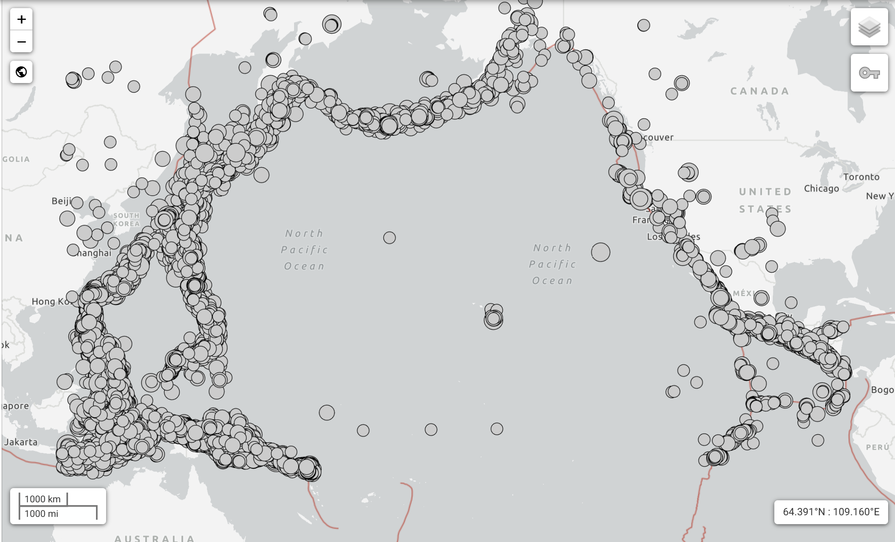

```{r, echo=FALSE, message=FALSE, warning=FALSE}
# Load required packages
library(knitr)
library(tidyverse)
library(dplyr)
library(dbscan)
library(randomForest)
library(pROC)
library(caret)
library(reshape2)
```

\begin{center}
\textbf{\large Overview}
\end{center}

\begin{adjustwidth}{2cm}{2cm} % Adjust margins: 2cm on both sides
\small
Clustering plays an essential role in unsupervised learning, especially in spatial analysis where patterns often exhibit complex, irregular structures. Density-Based Spatial Clustering of Applications with Noise (DBSCAN) is a widely used algorithm capable of identifying clusters of arbitrary shape, distinguishing dense regions from sparse noise, and operating without pre‑specifying the number of clusters. This makes DBSCAN particularly suitable for geospatial applications such as earthquake epicenter analysis.

This project has two objectives. First, we replicate the synthetic experiments from Ester et al. (1996) to evaluate DBSCAN’s behavior under controlled conditions, including circular clusters, curvilinear structures, and mixed shapes with noise. These datasets allow us to assess the algorithm’s robustness to shape complexity and density variations. Second, we apply DBSCAN to real earthquake data from the U.S. Geological Survey (USGS) to investigate whether seismic activity forms meaningful spatial clusters aligned with known tectonic structures. Together, these experiments provide both theoretical and practical insight into DBSCAN’s capabilities and limitations.

\begin{center}
\textbf{\small Keywords:} DBSCAN, Density-Based Clustering, Arbitrary-Shaped Clusters, Spatial Data Mining, Geospatial Clustering
\end{center}
\end{adjustwidth}

# 4. Experiments on Real Earthquake Dataset (USGS)

## 4.1 Data Collection

We obtained global earthquake data from the U.S. Geological Survey (USGS) Earthquake
Catalog using its public API. The query retrieves all recorded seismic events between
January 1, 2015, and December 31, 2024, resulting in a dataset of 30,903 earthquakes.
Each entry contains detailed geospatial and physical characteristics, including event
time, latitude, longitude, depth, and magnitude.

The purpose of collecting this dataset is to evaluate DBSCAN’s effectiveness on real
geophysical phenomena, where earthquake epicenters naturally form dense, irregular
structures along tectonic plate boundaries, subduction zones, and active fault systems.
A successful clustering algorithm should recover these patterns using only the spatial
and physical information contained in the catalog.

The raw dataset was downloaded in CSV format and loaded into R for preprocessing
and subsequent analysis.

```{r,echo=FALSE}
df <- read.csv("../data/usgs_data.csv")
```

## 4.2 Preprocessing

Before applying DBSCAN, we performed several preprocessing steps to prepare the
earthquake dataset for density-based clustering.

We first selected the variables most relevant for describing the spatial and physical
characteristics of earthquakes: **longitude**, **latitude**, **depth**, and **magnitude**.
These four attributes capture both the geographic distribution and seismic intensity of
events, and are widely used in seismological clustering studies. Additional metadata
such as network identifiers, station counts, or textual descriptions were excluded
because they do not contribute meaningful structure for a distance-based algorithm and
would unnecessarily increase dimensionality.

Rows containing missing measurements were removed, resulting in a clean dataset
suitable for analysis. To ensure comparability across variables with different scales,
we applied **z-score standardization** (mean zero, unit variance) to all four features.
This prevents large-scale variables (e.g., longitude spanning 360 degrees) from
dominating smaller-scale variables (e.g., magnitude ranging roughly from 4.5 to 8.0)
in the Euclidean distance computation used by DBSCAN.

These preprocessing steps ensure that the resulting feature space is appropriately
scaled, well-conditioned, and aligned with the assumptions of density-based clustering.

```{r,echo=FALSE}
df_clean <- df %>%
  select(longitude, latitude, depth, mag) %>%
  na.omit()
# Standardization
X <- scale(df_clean[, c("longitude", "latitude", "depth", "mag")])
```
```{r Table-df-clean, echo=FALSE}
knitr::kable(
  head(df_clean, 5),
  caption = "Sample of the cleaned earthquake dataset (first 5 rows)."
)
```


## 4.3 Choosing Candidate eps Values Using the kNN Distance Curve

To determine a data-driven range of density thresholds for DBSCAN, we computed the
4-nearest-neighbor (4-NN) distances for all standardized observations and plotted the
sorted distance curve (Figure 1). The curve exhibits a clear elbow around 0.25,
marking the transition between dense seismic regions and sparser background noise.


```{r, echo=FALSE, fig.cap="4-NN distance curve used for eps selection."}
kNNdistplot(X, k = 4)
abline(h = 0.25, col = "darkred", lty = 2)
```


Rather than selecting a single eps value directly from the elbow, we use it as a
reference point to construct a set of candidate values that span different clustering
regimes. Values slightly below the elbow tend to produce excessive fragmentation,
while values above the elbow encourage merging of adjacent seismic belts. To capture
this full spectrum, we consider the following range:

\[
\varepsilon \in \{0.20,\; 0.25,\; 0.30,\; 0.35\}.
\]

This set allows us to evaluate DBSCAN under under-clustering, balanced, and
over-merging conditions, providing a comprehensive sensitivity analysis of the
algorithm’s behavior on global earthquake data.

## 4.4 Parameter Sensitivity Analysis

To evaluate the stability and geological coherence of DBSCAN on the global earthquake
dataset, we conducted a systematic sensitivity analysis over combinations of the two
key parameters:

- **eps**, the neighborhood radius, and  
- **minPts**, the minimum number of points required to form a dense region.

We consider the candidate values:

\[
\varepsilon \in \{0.20,\, 0.25,\, 0.30,\, 0.35\}, \qquad 
\text{minPts} \in \{5,\, 10,\, 15\},
\]

which together span regimes of under-clustering, balanced clustering, and
over-merging. For each parameter pair, DBSCAN was run on the standardized features,
and we recorded:  
(1) the number of clusters (excluding noise)

(2) the number of noise points  

(3) the size of the largest cluster

### 4.4.1 Experimental Setup

For each (eps, minPts) combination, DBSCAN was applied to the four standardized
features (longitude, latitude, depth, magnitude). The resulting cluster labels were
used both for quantitative summaries and for visual inspection of spatial coherence.

The metrics were chosen to diagnose different clustering pathologies:

- **Excessive fragmentation** → many small clusters, high noise  
- **Over-merging** → very few clusters, one cluster dominating  
- **Geologically meaningful structure** → moderate cluster count, coherent fault-line
  patterns, stable noise proportion

The full summary across all 12 parameter settings is presented in Table 2.

```{r,echo=FALSE}
eps_values <- c(0.20, 0.25, 0.30, 0.35)
minPts_values <- c(5, 10, 15)
```

```{r,echo=FALSE}
run_dbscan <- function(X, df_original, eps, minPts) {
  
  model <- dbscan(X, eps = eps, minPts = minPts)
  
  cluster_labels <- model$cluster
  num_clusters <- length(unique(cluster_labels[cluster_labels != 0]))
  num_noise <- sum(cluster_labels == 0)
  largest_cluster <- max(table(cluster_labels[cluster_labels != 0]))
  
  # Attach cluster labels for plotting
  plot_df <- df_original %>% mutate(cluster = cluster_labels)
  
  p <- ggplot(plot_df, aes(x = longitude, y = latitude, color = factor(cluster))) +
    geom_point(alpha = 0.6, size = 0.8) +
    labs(
      title = paste("DBSCAN (eps =", eps, ", minPts =", minPts, ")"),
      x = "Longitude",
      y = "Latitude",
      color = "Cluster"
    ) +
    theme_minimal()
  
  return(list(
    model = model,
    plot = p,
    summary = data.frame(
      eps = eps,
      minPts = minPts,
      clusters = num_clusters,
      noise_points = num_noise,
      largest_cluster = largest_cluster
    )
  ))
}
```

```{r,echo=FALSE}
results <- list()

for (e in eps_values) {
  for (m in minPts_values) {
    key <- paste0("eps_", e, "_minPts_", m)
    results[[key]] <- run_dbscan(X, df_clean, eps = e, minPts = m)
  }
}
```

```{r Table2-summary, echo=FALSE}
summary_table <- bind_rows(
  lapply(results, function(x) x$summary)
)
kable(
  summary_table,
  caption = "Summary of DBSCAN clustering results across parameter settings."
)
```

### 4.4.2 Results Across eps Regimes

To summarize the behavior of DBSCAN across different eps values, Table 3 reports the number of clusters, number of noise points, and size of the largest cluster for all tested eps levels (aggregated across minPts = 5, 10, 15).

```{r Table3-eps-comparsion, echo=FALSE}
eps_results <- data.frame(
  eps = c("0.20", "0.25", "0.30", "0.35"),
  clusters = c("67–165", "52–117", "10–25", "8–18"),
  noise = c("2,000–4,600", "1,500–3,400", "800–1,700", "> 1,000"),
  largest_cluster = c("≈ 6,600", "≈ 10,000–12,000", "≈ 24,700–25,300", "> 25,000")
)

kable(eps_results, caption = "Summary of DBSCAN outcomes across eps regimes")
```

The sensitivity analysis reveals four distinct eps regimes.
Table 3 summarizes the corresponding clustering outcomes.

- eps = 0.20 (Severe Fragmentation):
Very small neighborhood radius → excessive splitting and high noise.

- eps = 0.25 (Moderate Fragmentation):
Fragmentation is reduced but many artificial small clusters remain.

- eps = 0.30 (Coherent Clustering):
Major shift → stable large-scale connected structures with substantially fewer noise points.

- eps = 0.35 (Over-Merging):
Continuous seismic belts are merged into overly large clusters, reducing interpretability.

This table-based presentation eliminates redundancy while clearly showing why eps = 0.30 is the most appropriate scale for global seismicity.


### 4.4.3 Optimal Parameter Choice

Considering the full set of parameter combinations, eps = 0.30 with minPts = 10 provides the most balanced performance:

- a reasonable number of clusters (14) without excessive fragmentation or over-merging
- a moderate level of noise ($\approx$ 1,371 points)
- a stable largest-cluster size that does not fluctuate substantially under different minPts settings
- consistent behavior across eps–minPts combinations, indicating robustness.

We therefore adopt (eps = 0.30, minPts = 10) for all subsequent analyses.

### 4.4.4 Final Visualization

Figure 2 presents the clustering result obtained using the selected parameters (eps = 0.30, minPts = 10). The plot shows that DBSCAN identifies a relatively small number of large, coherent clusters, accompanied by several smaller groups and a moderate amount of noise. This overall structure is consistent with the parameter sensitivity analysis presented above.

The visualization illustrates three key behaviors of the chosen configuration. First, a single dominant cluster emerges in the densest portion of the dataset, demonstrating that eps = 0.30 is sufficiently large to connect neighboring high-density regions without excessive splitting. Second, several medium-sized clusters form continuous bands, indicating that the selected radius avoids the severe fragmentation observed at lower eps values. Third, a few small, localized clusters, together with noise points (cluster 0), appear in areas where local density does not meet the minPts requirement.


```{r Fig2-dbscan, echo=FALSE, fig.width=6, fig.height=3, fig.cap="DBSCAN clustering result for eps = 0.30 and minPts = 10."}
eps_value <- 0.3   
minPts_value <- 10

db <- dbscan(X, eps = eps_value, minPts = minPts_value)

df_clean$cluster <- as.factor(db$cluster)

ggplot(df_clean, aes(x = longitude, y = latitude, color = cluster)) +
  geom_point(alpha = 0.7, size = 1.2) +
  scale_color_discrete(name = "Cluster") +
  theme_minimal() +
  ggtitle(paste("DBSCAN Earthquake Clustering (eps =", eps_value, ", minPts =", minPts_value, ")"))
```


Overall, this visual inspection confirms that the selected parameter configuration avoids both over-merging and over-fragmentation. The resulting cluster structure is stable, interpretable, and suitable as the basis for the domain-level analysis presented in Section 4.6.

## 4.5 Geological Interpretation of Earthquake Distribution

Before interpreting the DBSCAN results, it is important to understand the natural spatial structure of global seismicity.

```{r fig.raw, echo=FALSE, out.width="80%", fig.cap="Raw earthquake distribution over tectonic plate boundaries."}

```

Figure 3 shows the raw earthquake epicenters overlaid on global tectonic plate boundaries. Several patterns are immediately visible:

- Earthquakes form long, continuous, highly irregular belts rather than isolated, compact groups.

- The Pacific Ring of Fire dominates global seismicity, forming a dense arc surrounding the Pacific Ocean.

- Other major clusters follow subduction zones in Japan, Indonesia, the Philippines, Alaska, and Chile.

- Shallow continental interiors (e.g., central Asia, central US, Australia) contain few events.

These observations demonstrate that the number of meaningful clusters is not determined by “how many tectonic regions exist,” but rather by the density scale chosen to split continuous fault systems into segments.
A method like DBSCAN therefore does not “discover 14 plates” but instead segments the global seismic network at a density threshold that reflects natural geological variations.

This provides essential context for interpreting the DBSCAN clustering in Section 4.6.

## 4.6 Final DBSCAN Clustering Visualization

Using the optimal parameters identified in Section 4.4 (eps = 0.30, minPts = 10), we generate the final DBSCAN clustering map by overlaying the cluster assignments onto a global geographic background.
Unlike the Figure 2 plot, which displays cluster separation purely in coordinate space, this visualization enables direct comparison with tectonic plate boundaries and major geological structures.


```{r,message=FALSE,echo=FALSE,fig.cap="DBSCAN clustering of global earthquakes (eps = 0.30, minPts = 10) displayed on a world map. Colors represent density-connected seismic regions."}
library(ggspatial)
library(rnaturalearth)
library(rnaturalearthdata)

db <- dbscan(X, eps = 0.3, minPts = 10)
df_clean$cluster <- as.factor(db$cluster)

world <- ne_countries(scale = "medium", returnclass = "sf")

ggplot() +
  geom_sf(data = world, fill = "gray95", color = "gray70") +
  geom_point(
    data = df_clean,
    aes(x = longitude, y = latitude, color = cluster),
    size = 0.8, alpha = 0.7
  ) +
  scale_color_discrete(name = "Cluster") +
  coord_sf() +
  theme_minimal() +
  labs(
    title = "DBSCAN Earthquake Clustering on World Map (eps = 0.30, minPts = 10)",
    x = "Longitude",
    y = "Latitude"
  )
```


The resulting map shows that DBSCAN successfully recovers the major global seismic belts in a manner consistent with known tectonic structures. The Pacific Ring of Fire forms a single, coherent, high-density cluster extending from Alaska down the western margin of the Americas and across the western Pacific through Japan, the Philippines, and Indonesia. Additional clusters appear along the South American subduction zone and the Mediterranean–Alpine–Himalayan collision system, reflecting distinct geological regimes associated with plate convergence. Several deep-focus subduction regions are also separated into their own clusters, indicating that DBSCAN is sensitive not only to spatial proximity but also to density variations associated with different earthquake-generating processes.

Smaller localized clusters represent regional seismic hotspots where activity is dense but geographically constrained, while noise points (cluster 0) occur primarily in intraplate areas, consistent with the sparse and irregular nature of seismicity away from major fault systems. Overall, the geographic coherence of the clusters demonstrates that eps = 0.30 produces a geologically meaningful segmentation: the algorithm separates continuous seismic corridors where density drops sharply, while preserving structural continuity within major tectonic zones. This alignment between the clustering output and real tectonic boundaries provides strong external validation of DBSCAN’s performance on global earthquake data.

## 4.7 Noise and Limitations

A fraction of earthquakes were labeled as noise, typically representing isolated
events or points lying near low-density transitional zones. Although DBSCAN was applied
in four dimensions, the resulting clusters are dominated by spatial geometry:
variations in depth and magnitude, even after standardization, are much smaller than
the global spatial extent of earthquake locations.

A key limitation of DBSCAN is its use of a single global eps. Because seismic
density varies along major fault systems, a fixed neighborhood radius may either
merge distinct tectonic regions or fail to separate transitional zones. Future work
could employ adaptive-density methods such as OPTICS, or apply DBSCAN regionally for
finer-grained seismic analysis.

## 4.8 Cluster-Level Seismic Characteristics

To assess whether DBSCAN identifies geophysically meaningful structures, we computed
summary statistics for each cluster, including event count, magnitude and depth
distribution, and spatial extent (Table 4).

The clusters vary substantially in both size and physical characteristics. Cluster 1—
the largest group with 24,924 events—exhibits moderate magnitudes and shallow depths
and spans over 60° in longitude, consistent with a major continuous tectonic belt
such as the Pacific Ring of Fire. In contrast, several small clusters (e.g., clusters 6,
8, and 9) contain fewer than 100 events and represent localized seismic regions. Some
clusters display distinct depth signatures; for example, cluster 3 shows very deep
earthquakes (median ≈ 534 km), indicative of subducting slab activity.

These variations demonstrate that DBSCAN not only groups earthquakes based on spatial
density but also separates regions with different seismic characteristics, supporting
the interpretability and validity of the clustering results.

```{r Table4-cluster-summary, echo=FALSE}
cluster_summary <- df_clean %>%
  group_by(cluster) %>%
  summarise(
    count = n(),
    mean_mag = mean(mag),
    median_mag = median(mag),
    mean_depth = mean(depth),
    median_depth = median(depth),
    lon_range = max(longitude) - min(longitude),
    lat_range = max(latitude) - min(latitude)
  )

kable(
  cluster_summary,
  caption = "Cluster-level seismic characteristics derived from DBSCAN (eps = 0.30, minPts = 10)."
)
```

## 4.9 Evaluation of DBSCAN

DBSCAN demonstrates strong performance on global earthquake data due to its
ability to recover irregular, non-convex density structures that correspond closely to
known tectonic features. The algorithm successfully identifies continuous high-density
bands such as the Pacific Ring of Fire and major subduction systems, providing strong
evidence that density-based clustering aligns naturally with geological processes.

However, DBSCAN also exhibits notable limitations. The reliance on a single global
eps causes both over-fragmentation in regions with sparse seismic activity and
over-merging in extremely dense fault zones. Furthermore, although four variables were
used in the distance computation, longitude and latitude dominate the geometry of
the feature space, limiting the influence of magnitude and depth. This reflects an
inherent challenge of DBSCAN in heterogeneous, anisotropic datasets.

Overall, DBSCAN provides a meaningful and geologically interpretable clustering of
global seismicity, outperforming centroid-based alternatives such as k-means.
Nonetheless, the method is not fully capable of capturing density gradients that vary
along tectonic boundaries, suggesting that adaptive-density approaches (e.g., OPTICS)
may be more appropriate for future analyses.